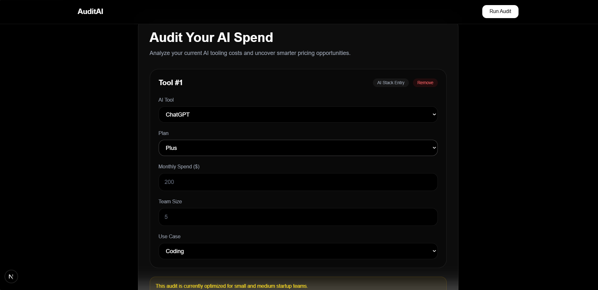
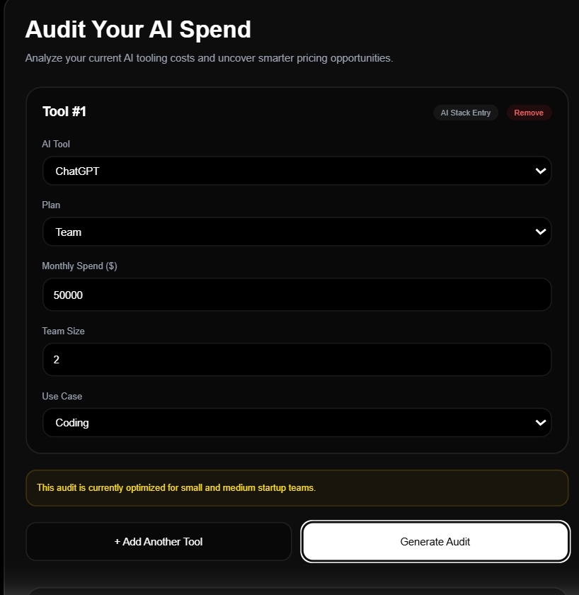
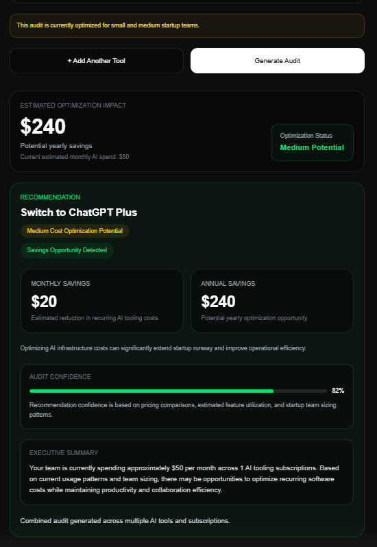
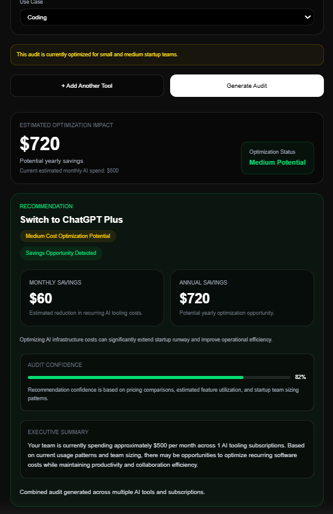
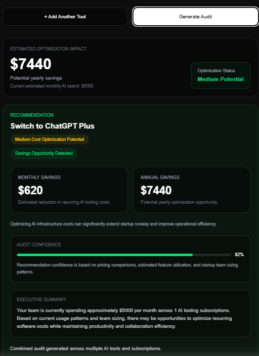
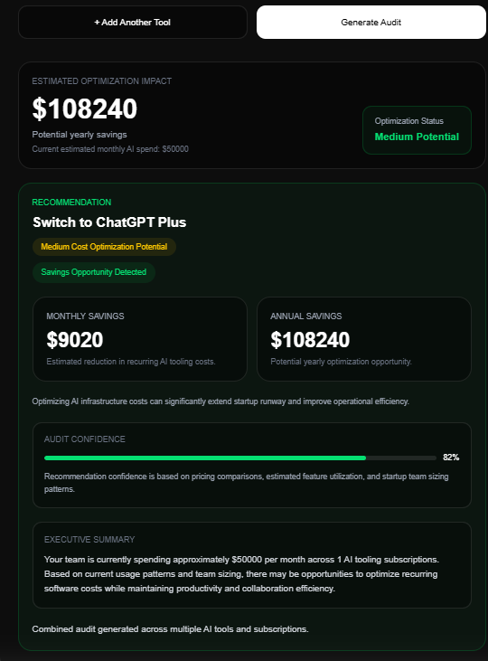

# AI Spend Audit

AI Spend Audit is a SaaS-style dashboard that helps startups analyze AI tooling costs, identify optimization opportunities, and estimate savings across multiple AI subscriptions.

---

## Features

- Multi-tool AI subscription auditing
- Dynamic savings calculations
- Executive summary generation
- Spend-based optimization analysis
- Reusable React component architecture
- Dashboard-style analytics UI
- Validation and UX safeguards

---

## Screenshots

### Landing Page


---

### Dashboard



---

### Multi Tool Dashboard



---

### Audit Results











## Tech Stack

- Next.js
- React
- TypeScript
- Tailwind CSS

---

## Local Setup

```bash
npm install
npm run dev